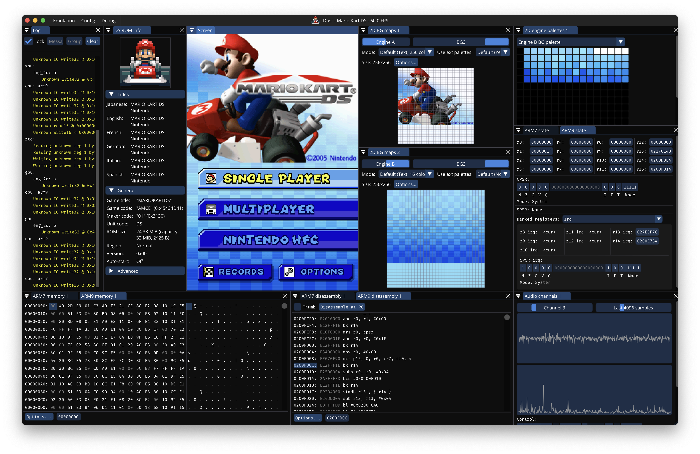

# Dust

## Prebuilt binaries

| Release | Debug (includes logging and debugging views) |
| ------- | -------------------------------------------- |
| [Windows (release)](https://nightly.link/Kelpsy/dust/workflows/build-release/main/Windows.zip) | [Windows (debug)](https://nightly.link/Kelpsy/dust/workflows/build-release/main/Windows-debug.zip) |
| [Linux (release)](https://nightly.link/Kelpsy/dust/workflows/build-release/main/Linux.zip) | [Linux (debug)](https://nightly.link/Kelpsy/dust/workflows/build-release/main/Linux-debug.zip) |
| [macOS (release)](https://nightly.link/Kelpsy/dust/workflows/build-release/main/macOS.zip) | [macOS (debug)](https://nightly.link/Kelpsy/dust/workflows/build-release/main/macOS-debug.zip) |
